---

---
## MeshPnP3D 사용법
---
**3D 메시 기반 항공영상 위치추정**

항공에서 찍은 영상 한 장을 미리 만들어 둔 3D 메시 참조와 맞춰, 촬영 당시 카메라 위치를 계산합니다. GPS 없이 영상만으로 위치를 냅니다.

화면(대시보드)과 명령줄(CLI)이 **같은 실행파일 하나** 안에 들어 있습니다. 인자 없이 실행하면 창이 뜨고, 인자를 주면 콘솔로 돕니다.

---

## 1. 시작하기

1. 압축을 **폴더째** 풉니다. `app` 폴더가 `RUN MeshPnP3D.cmd` 옆에 있어야 합니다.
2. **`RUN MeshPnP3D.cmd`** 를 더블클릭합니다.

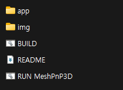

```
MeshPnP3D/
├─ RUN MeshPnP3D.cmd      실행 진입점
├─ BUILD.cmd              재빌드 (개발자용, 일반 사용자는 필요 없음)
├─ MeshPnP3D 사용법.md    이 문서
├─ MeshPnP3D 사용법.pdf   같은 내용의 PDF
├─ img/                   문서용 그림
├─ app/                   실행파일과 데이터
│   ├─ MeshPnP3D.exe
│   ├─ models/            신경망 매처 가중치
│   │   └─ dense/         ★RoMa 모델 — 따로 받아서 넣습니다(1-1 참조)★
│   ├─ data/              참조 3D 메시 아카이브 (.rtra) ★따로 받아서 넣습니다(1-2 참조)★
│   └─ mapcache/          지도 배경 영상
└─ results/               ★실행하면 여기에 결과가 쌓입니다★
```

> 폴더 구조를 바꾸거나 파일을 옮기면 실행되지 않습니다.

### 1-1. RoMa 모델 넣기 (따로 받은 경우)

RoMa 모델은 **8 GB** 로 커서 본체와 따로 전달됩니다. 없어도 프로그램은 정상적으로 실행되며, 매처 목록에서 RoMa 계열이 **`roma-fast (모델 없음)`** 처럼 표시됩니다. 그 상태로는 고를 수는 있어도 실행 버튼이 잠깁니다.

**받는 곳**: https://github.com/hyuneu-n/roma-onnx/releases/tag/onnx

받은 압축파일을 풀면 `dense` 폴더가 나옵니다. 그 폴더를 통째로 여기에 넣으세요.

```
MeshPnP3D\app\models\dense\
```

넣고 나면 이렇게 되어야 합니다.

```
MeshPnP3D/app/models/
├─ superpoint_512.onnx        (본체에 들어 있음)
├─ superpoint_1024.onnx
├─ ...
└─ dense/                     ← ★여기★
   ├─ romav2_fast.onnx
   ├─ romav2_turbo.onnx
   ├─ romav2_base.onnx
   ├─ romav2_precise.onnx
   ├─ romav2_extractor_fast.onnx
   ├─ romav2_extractor_turbo.onnx
   ├─ romav2_matchhead_fast.onnx
   ├─ romav2_matchhead_turbo.onnx
   └─ kde_density.onnx
```

프로그램을 다시 켜면 이름 뒤의 `(모델 없음)` 이 사라지고 `roma-fast` · `roma-turbo` · `roma-base` · `roma-precise` 를 쓸 수 있습니다. **재설치나 재빌드는 필요 없습니다.**

> `kde_density.onnx` 도 RoMa 에 필요합니다(밀도 계산용, 2 KB). 압축에 함께 들어 있으니 `dense` 폴더를 통째로 넣으면 됩니다.
>
> 이름 뒤에 `(모델 없음)` 이 계속 보이면 파일이 위 경로에 없는 것입니다. 경로를 다시 확인하세요.

### 1-2. 참조 3D 메시(.rtra) 넣기

참조 메시 아카이브도 용량이 커서 따로 전달됩니다. 받은 `.rtra` 파일을 여기에 넣으면 프로그램이 켜질 때 자동으로 잡습니다.

```
MeshPnP3D\app\data\
```

다른 곳에 두어도 됩니다 — 그때는 화면의 `레퍼런스 rtra 파일` 칸에 그 경로를 직접 지정하면 됩니다.

---

## 2. 화면 구성

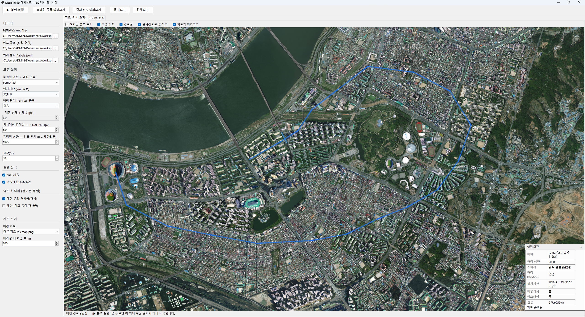

| 영역 | 설명 |
|---|---|
| **위쪽 툴바** | 실행·불러오기·통계 버튼과 진행바 |
| **왼쪽 사이드바** | 데이터 경로, 모델·설정 |
| **오른쪽 탭** | `지도` — 추정 위치를 지도 위에 / `프레임 분석` — 한 장씩 매칭 결과 |
| **우측 하단** | 지금 설정으로 **실제 적용되는** 조건 요약 |

### 툴바

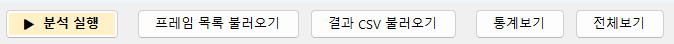

| 버튼 | 하는 일 |
|---|---|
| ▶ 분석 실행 | 쿼리 전체를 계산합니다. 실행 중에는 `■ 중지` 로 바뀝니다 |
| 프레임 목록 불러오기 | 계산 없이 쿼리 목록만 읽어 지도에 경로를 그립니다 |
| 결과 CSV 불러오기 | 이전에 돌린 결과를 지도에 올립니다 |
| 통계보기 | 오차 분포 그래프 창을 엽니다 |
| 전체보기 | 지도를 경로 전체가 보이도록 맞춥니다 |

---

## 3. 설정

### 3-1. 데이터 경로

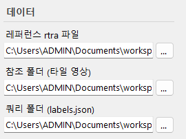

세 곳을 지정합니다. 폴더를 칸에 **끌어다 놓아도** 됩니다.

| 칸 | 무엇 | 비고 |
|---|---|---|
| 레퍼런스 rtra 파일 | 참조 3D 메시 아카이브 | `app\data` 에 동봉된 것이 기본값 |
| 참조 폴더 (타일 영상) | 참조 타일 영상과 `captures.csv` | **매칭에 쓸 그림이라 필수** |
| 쿼리 폴더 (labels.json) | 위치를 구할 영상과 라벨 | |

> `.rtra` 는 3D 좌표를 조회하는 아카이브이고, 매칭에 쓰는 **그림은 참조 폴더에 있습니다.** 둘 다 필요합니다.

### 3-2. 특징점 검출 + 매칭 모델

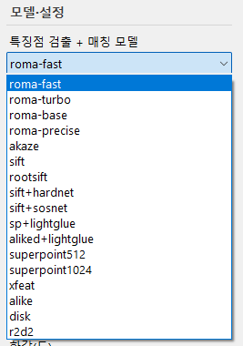

이름 규칙이 셋 있습니다.

| 규칙 | 뜻 | 예 |
|---|---|---|
| `+` | 검출기와 서술자·매처를 **결합**한 조합 | `sift+hardnet`, `sp+lightglue` |
| 숫자 | **입력 해상도** | `superpoint512` / `superpoint1024` |
| `roma-*` | 같은 모델의 **해상도 세팅**. 뒤로 갈수록 크고 느림 | `turbo`(320) → `fast`(512) → `base`(640) → `precise`(800) |

기본값은 `roma-fast` 입니다.

### 3-3. 위치계산 (PnP 솔버)

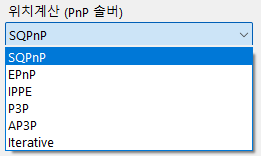

`SQPnP`(기본) · `EPnP` · `IPPE` · `P3P` · `AP3P` · `Iterative`

### 3-4. 매칭 단계 RANSAC

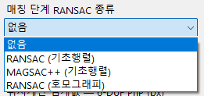

매칭점을 PnP 에 넣기 전에 기하로 한 번 거릅니다. 기본은 `없음` 입니다.

### 3-5. 임계값과 상한

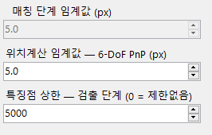

| 칸 | 기본 | 설명 |
|---|---|---|
| 매칭 단계 임계값 (px) | 5.0 | 위 필터가 `없음` 이면 **쓰이지 않아 잠깁니다** |
| 위치계산 임계값 — 6-DoF PnP (px) | 5.0 | 추정 자세로 3D 점을 되찍었을 때 이보다 벗어나면 이상치로 버립니다 |
| 특징점 상한 — 검출 단계 | 5000 | `0` 을 넣으면 제한 없이 씁니다. 매처에 따라 무시되며, 그럴 때는 칸이 잠깁니다 |

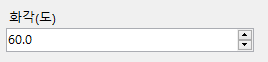

카메라 화각(도). 시뮬레이션 데이터는 60도로 고정되어 있습니다.

### 3-6. 실행 방식

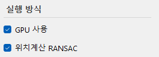

| 항목 | 기본 | 설명 |
|---|---|---|
| GPU 사용 | 켬 | ONNX 매처에만 해당. 고전 매처(`sift`·`akaze`·`rootsift`)는 CPU 로만 돌아 잠깁니다 |
| 위치계산 RANSAC | 켬 | 끄면 이상치 제거 없이 전체 점으로 풉니다 |

### 3-7. 속도 최적화

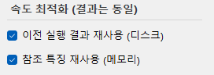

**둘 다 결과를 바꾸지 않고 속도만 바꿉니다.** 다만 하는 일이 다릅니다.

| 항목 | 무엇을 아끼나 | 어디에 | 언제까지 |
|---|---|---|---|
| **이전 실행 결과 재사용 (디스크)** | 매칭 결과 자체 | 파일 (`app\matchcache`) | **프로그램을 껐다 켜도 남습니다** |
| **참조 특징 재사용 (메모리)** | 참조 영상의 특징 | 메모리 | 실행이 끝나면 사라집니다 |

즉 위는 *"어제 한 계산을 그대로 꺼내 쓰기"*(같은 설정으로 다시 돌리면 매칭을 통째로 건너뜀), 아래는 *"이번 실행 안에서 같은 참조 타일을 두 번 안 뽑기"* 입니다. 설정을 하나라도 바꾸면 위쪽 캐시는 자동으로 무효가 됩니다.

---

## 4. 지도

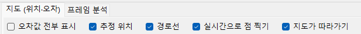

| 항목 | 뜻 |
|---|---|
| 오차값 전부 표시 | 프레임마다 오차 수치를 지도에 표시 |
| 추정 위치 | 계산된 위치를 점으로 표시 |
| 경로선 | 프레임 순서대로 선으로 연결 |
| 실시간으로 점 찍기 | 실행 중에도 결과가 하나씩 찍힘 |
| 지도가 따라가기 | 새 점이 찍힐 때 화면이 따라 이동 |

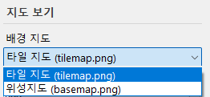

배경은 `타일 지도`(참조 타일을 이어 붙인 것)와 `위성지도` 중에서 고릅니다. 위성지도 파일이 없으면 `(파일 없음)` 이 붙고 선택되지 않습니다.

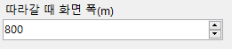

`지도가 따라가기` 를 켰을 때 유지할 화면 폭(m)입니다.

실행 중에는 결과가 하나씩 찍히며 지도가 따라갑니다.

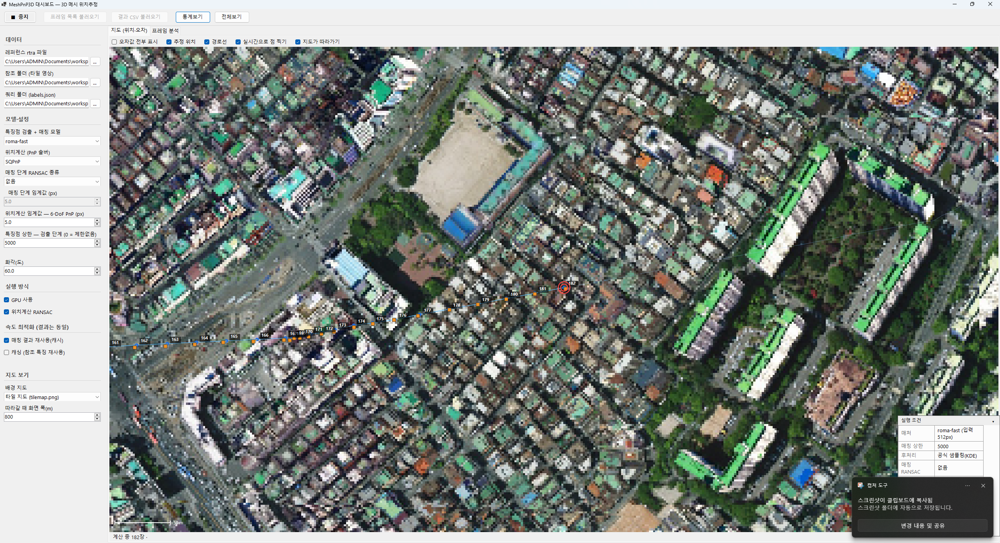

---

## 5. 실행 조건 요약

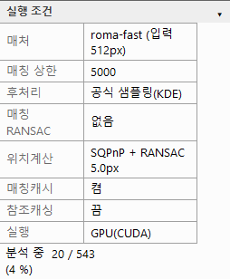

우측 하단에 떠 있습니다. **고른 값이 아니라 실제로 적용되는 값**을 보여주는 것이 핵심입니다 — 무시되는 설정이 있으면 그렇게 표시됩니다.

- 제목줄을 **끌어서 옮길 수 있습니다**
- `▾` 로 접힙니다
- 아래쪽에 진행 상황과 저장 위치가 표시됩니다

---

## 6. 프레임 분석

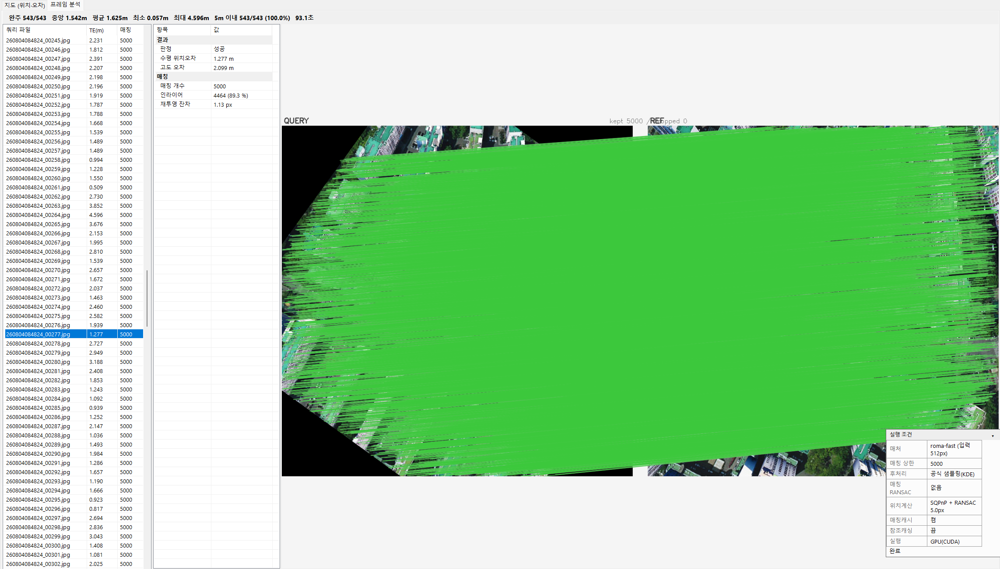

왼쪽 목록에서 프레임을 고르면 그 장의 매칭 결과를 봅니다. 초록 선은 살아남은 대응점, 회색은 필터가 버린 점이며, 위쪽에 `kept N / dropped M` 이 표시됩니다.

---

## 7. 통계

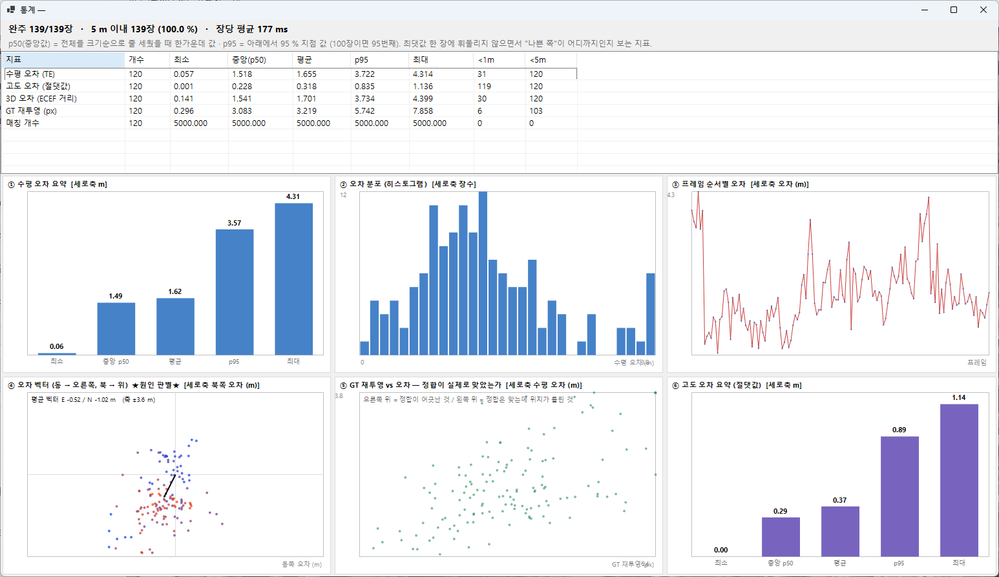

상단에 완주 장수, 5 m 이내 비율, **장당 평균 처리시간**이 나옵니다. 실행 중에도 열 수 있고 그래프가 갱신됩니다(`실시간으로 점 찍기` 가 켜져 있어야 합니다).

---

## 8. 결과 파일

실행이 끝나면 **자동으로 저장됩니다.** 별도 저장 버튼을 누를 필요가 없습니다.

```
results/
└─ 20260828_153012_roma-fast_tilemanager-sqpnp/    ← 실행할 때마다 하나씩
   ├─ results.csv          프레임별 상세
   ├─ summary.csv          이번 실행의 전체 지표
   └─ summary_table.csv    ★보고서에 붙여넣는 표★
```

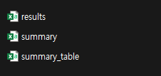

### 8-1. `summary_table.csv` — 보고서에 붙여넣는 표

실행 폴더마다 하나씩 생기며, 머리글 한 줄과 값 한 줄로 되어 있습니다. 여러 번 돌린 뒤 이 파일들을 모아 붙이면 그대로 모델 비교표가 됩니다.

| 열 | 뜻 |
|---|---|
| `query_dir` | 쿼리 폴더 경로 |
| `model` | 쓴 매처 이름 |
| `input_px` | 입력 해상도. 고전 매처는 고정 입력이 없어 **빈칸** |
| `p50_m` | 위치오차 중앙값 (m) |
| `p95_m` | 위치오차 상위 5 % 지점 (m). 나쁜 쪽이 어디까지인지 보는 값 |
| `mean_m` | 위치오차 평균 (m) |
| `under_5m_pct` | 오차 5 m 미만인 프레임 비율 (%) |
| `ms_per_frame` | 장당 처리시간 (ms) |

스프레드시트로 열면 그대로 표가 됩니다.

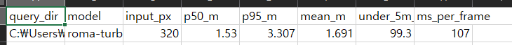

> 값에 단위를 붙이지 않은 것은 **스프레드시트에서 숫자로 다루기 위해서**입니다. 열 이름이 단위를 말해 줍니다. 여러 실행의 이 파일을 모으면 모델 비교표가 됩니다.

### 8-2. `results.csv` — 프레임별 상세

한 줄이 쿼리 한 장입니다. 주요 열만 적으면 이렇습니다.

| 열 | 뜻 |
|---|---|
| `query` · `ref` | 쿼리 파일명 · 짝지은 참조 타일 |
| `ok` | 위치가 계산되었으면 1 |
| `te_m` | **수평 위치오차 (m)** — 가장 많이 보는 값 |
| `err_e` · `err_n` | 오차를 동/북 성분으로 나눈 값 (m) |
| `alt_err_m` | 고도 오차 (m) |
| `matches` · `inliers` | 매칭점 수 · RANSAC 이 인정한 점 수 |
| `mfilter_inliers` | 매칭 단계 필터가 남긴 점 수 |
| `reproj_px` · `reproj_inlier_px` | 재투영 오차 (px) · 인라이어만의 재투영 오차 |
| `gt_reproj_px` | **정답 자세로** 되찍은 재투영 오차 (px). 매칭 자체의 품질 지표 |
| `rot_err_deg` | 회전오차 (도). 추정 회전과 정답 회전 사이의 각도 |
| `mesh_z_med` · `mesh_z_range` | 조회된 3D 점 높이의 중앙값 · 최대−최소(건물 기복) |
| `dop` · `spread` | 기하 배치 지표 · 매칭점이 화면에 퍼진 정도 |
| `gt_lon` · `gt_lat` | 정답 위경도 |
| `ms_*` | 단계별 소요시간 (ms) — 읽기 · 매칭 · 3D화 · 위치계산 등 |
| `kp_query` · `kp_ref` | 쿼리 · 참조에서 검출된 특징점 수 |
| `note` | 실패 사유 등 |

### 8-3. `summary.csv` — 실행 한 건의 전체 지표

`results.csv` 를 요약한 **한 줄**입니다. 위 지표들의 중앙값·평균에 더해 실행 조건(매처·솔버·상한·시드), 단계별 시간, 메모리 피크, 참조 DB 정보까지 담고 있어 열이 많습니다. 자세한 분석용이며, **표로 옮길 때는 `summary_table.csv` 를 쓰는 것이 편합니다.**

---

## 9. 명령줄로 실행하기

같은 실행파일에 인자를 주면 창 없이 콘솔로 돕니다. 여러 조건을 배치로 돌릴 때 유용합니다.

### 9-1. 기본형

압축을 푼 폴더에서 시작합니다.

```bat
cd /d "C:\...\MeshPnP3D"

app\MeshPnP3D.exe ^
  --rtra  "app\data\index(v10,분할압축).rtra" ^
  --ref   "D:\3Ddata\260713170055_308_50_1_000" ^
  --query "D:\data\city300" ^
  --matcher roma-fast --gpu --max-kp 5000 ^
  --out   results
```

PowerShell 이라면 줄바꿈 기호가 `` ` `` 입니다.

```powershell
cd "C:\...\MeshPnP3D"

.\app\MeshPnP3D.exe `
  --rtra  "app\data\index(v10,분할압축).rtra" `
  --ref   "D:\3Ddata\260713170055_308_50_1_000" `
  --query "D:\data\city300" `
  --matcher roma-fast --gpu --max-kp 5000 `
  --out   results
```

한 줄로 써도 됩니다.

```bat
app\MeshPnP3D.exe --rtra "app\data\index(v10,분할압축).rtra" --ref "<참조폴더>" --query "<쿼리폴더>" --matcher roma-fast --gpu --max-kp 5000 --out results
```

### 9-2. 꼭 필요한 인자

| 인자 | 설명 |
|---|---|
| `--rtra <path>` | 참조 3D 메시 아카이브 |
| `--ref <dir>` | 참조 폴더 (타일 영상 + `captures.csv`) |
| `--query <dir>` | 쿼리 폴더 |

### 9-3. 자주 쓰는 인자

| 인자 | 기본 | 설명 |
|---|---|---|
| `--matcher <name>` | `roma-fast` | 화면 목록과 같은 이름을 씁니다. 단 **화면 표시명이 아니라 내부 이름**입니다 (`sp+lightglue` → `sp-lightglue`, `superpoint512` → `superpoint`) |
| `--gpu` | 끔 | ONNX 매처를 GPU 로 실행 |
| `--max-kp <N>` | 5000 | 검출 단계 특징점 상한. `0` 은 제한 없음 |
| `--solver <name>` | `sqpnp` | `epnp` · `ippe` · `p3p` · `ap3p` · `iterative` |
| `--thr-pnp <px>` | 5.0 | PnP RANSAC 재투영 임계 |
| `--no-pnp-ransac` | — | 위치계산에서 RANSAC 끄기 |
| `--match-filter <k>` | `none` | `homo-ransac` · `fund-ransac` · `fund-magsac` 등 |
| `--thr-match <px>` | 5.0 | 위 필터의 임계 (필터를 켰을 때만) |
| `--ref-feats` | 끔 | 참조 특징 재사용 (화면의 "참조 특징 재사용") |
| `--no-match-cache` | — | 이전 실행 결과 재사용 끄기. **조건을 바꿔가며 잴 때는 켜 두세요** |
| `--only <spec>` | — | 이 프레임만 (예: `00060-00075`) |
| `--exclude <spec>` | — | 이 프레임 제외 |
| `--limit <n>` | — | 앞에서 n 장만 |
| `--out <dir>` | `results` | 결과 폴더 |

전체 목록은 인자 없이 `--help` 로 볼 수 있습니다.

```bat
app\MeshPnP3D.exe --help
```

### 9-4. 여러 조건을 이어서 돌리기

`--out` 을 같게 두면 `summary_table.csv` 에 한 줄씩 쌓여 비교표가 만들어집니다.

```bat
cd /d "C:\...\MeshPnP3D"
set RTRA=app\data\index(v10,분할압축).rtra
set REF=D:\3Ddata\260713170055_308_50_1_000
set QRY=D:\data\city300

for %%M in (roma-turbo roma-fast roma-base sift) do (
  app\MeshPnP3D.exe --rtra "%RTRA%" --ref "%REF%" --query "%QRY%" ^
    --matcher %%M --gpu --max-kp 5000 --no-match-cache --out results
)
```

> 조건을 바꿔가며 성능을 잴 때는 `--no-match-cache` 를 붙이세요. 안 붙이면 이전 실행의 매칭 결과를 그대로 꺼내 써서 시간이 실제보다 짧게 나옵니다.

---

## 10. 필요 사양

|          |                                                  |
| -------- | ------------------------------------------------ |
| 운영체제     | Windows 10 이상 (64비트)                             |
| .NET     | **설치 불필요** — 실행에 필요한 것이 모두 들어 있습니다               |
| GPU (선택) | NVIDIA GPU + CUDA 12 계열 드라이버. 없으면 CPU 로 동작합니다    |
| 메모리      | 매처에 따라 다르며, 신경망 매처는 수 GB 를 씁니다                   |
| 디스크      | 본체 약 0.8 GB · RoMa 모델을 넣으면 +8 GB · 참조 메시(.rtra)를 넣으면 +1.3 GB |

---

## 11. 다시 빌드하기 (개발자용)

소스가 있는 환경에서 `BUILD.cmd` 를 실행하면 `app\` 이 갱신됩니다. .NET SDK 가 필요합니다. 일반 사용자는 쓸 일이 없습니다.
