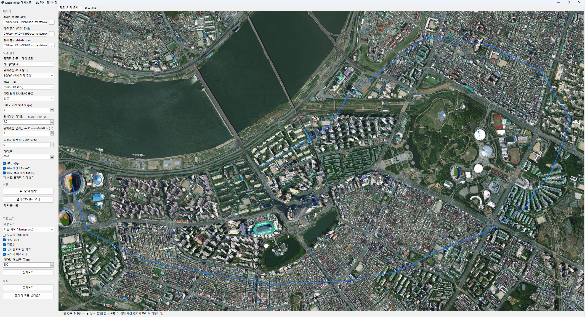
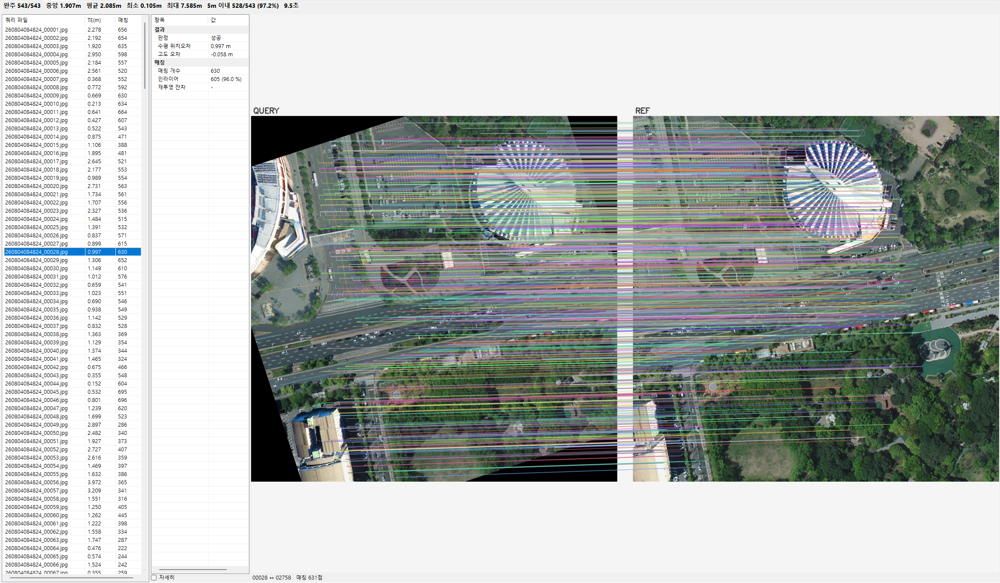

# MeshPnP3D

**3D 메시 기반 항공영상 위치추정 대시보드**

GPS 없이, 항공영상 한 장으로 카메라가 있던 위치를 계산합니다.
쿼리 영상과 3D 메시에서 렌더한 참조 타일을 매칭하고, 참조 픽셀의 실제 3D 좌표를 메시에서 조회해 카메라 위치를 역산합니다.

```
쿼리 영상 ──┐
            ├─→ 특징점 매칭 ─→ 참조 픽셀을 3D로 ─→ 위치 계산 ─→ 위치 + 오차(TE)
참조 타일 ──┘                   (메시 조회)         (PnP)
```

---

## 빠른 시작

```
1. 압축을 풀고  "RUN MeshPnP3D.cmd"  를 두 번 클릭
2. 왼쪽 [데이터] 칸에 폴더 두 개를 지정
3. [▶ 분석 실행]
```

설치 과정은 없습니다. 필요한 것은 **Windows 10/11 64비트 + [.NET 10 데스크톱 런타임](https://dotnet.microsoft.com/download/dotnet/10.0)** 뿐이고,
없으면 실행할 때 안내 창이 뜨면서 받는 곳으로 연결됩니다.

---

## 화면

### 지도 — 경로와 오차를 한눈에



| 표시 | 뜻 |
|---|---|
| 파란 점 | 정답 위치 (`labels.json`) |
| 주황 / 빨강 네모 | 계산된 위치 (**빨강 = 오차 5 m 초과**) |
| 노란 선 | 둘을 잇는 선 — **선 길이가 곧 오차** |
| 왼쪽 아래 | 축척 막대 |

휠로 확대·축소, 드래그로 이동, 마커를 클릭하면 상세 창이 열리고, 가운데 클릭으로 전체보기.

### 프레임 분석 — 매칭이 실제로 맞았는지



프레임 목록에서 한 장을 고르면 **쿼리 ↔ 참조의 대응선**을 그대로 보여줍니다.
오차가 큰 프레임이 왜 틀렸는지(매칭이 엉켰는지, 특징이 없는 지형인지) 눈으로 확인할 수 있습니다.

---

## 지정할 것은 두 개뿐

| 칸 | 예 |
|---|---|
| **참조 폴더** (타일 영상) | `3Ddata\260713170055_600_50_2_000` |
| **쿼리 폴더** (`labels.json` 포함) | `비행데이터셋\260804084824(300)` |

칸에 폴더를 마우스로 끌어다 놓아도 됩니다.
신경망 모델·지도·카메라 설정은 전부 동봉돼 있어 손댈 필요가 없습니다.

> **`.rtra` 메시 아카이브는 들어 있지 않습니다** (1.3 GB라 뺐습니다).
> 갖고 계신 파일 경로를 왼쪽 첫 칸에 넣거나, `app\data\` 에 두면 다음 실행부터 자동으로 잡힙니다.

---

## 결과 읽기

상세 창의 값들:

| 항목 | 뜻 |
|---|---|
| **수평 오차 (TE)** | 계산 위치와 정답 위치의 수평거리 — **주지표** |
| 고도 오차 | 계산 고도 − 정답 고도 |
| 3D 오차 (ECEF) | 위 둘을 합친 직선거리 |
| 오차 동/북 성분 | 오차의 방향. 한쪽으로 쏠리면 계통오차, 흩어지면 매칭 잡음 |
| **GT 재투영** | 정답 위치로 되쏘았을 때의 픽셀 오차 — **정합이 실제로 맞았는지를 눈이 아니라 숫자로 보는 값** |

결과 CSV는 `app\results\dashboard\` 에 자동으로 쌓입니다.
이미 돌려둔 결과는 [결과 CSV 불러오기]로 즉시 띄울 수 있습니다.

---

## 설정

왼쪽 [모델·설정]을 건드리면 상태 문구가 빨갛게 바뀝니다.
**[▶ 분석 실행]을 다시 눌러야 반영됩니다** — 자동으로 다시 계산하지 않습니다.

| 설정 | 선택지 |
|---|---|
| 특징점 검출 + 매칭 모델 | `sp-lightglue`(기본, 빠름) · `akaze` · `sift` · `r2d2` · `alike` … |
| 위치계산 (PnP 솔버) | `SQPnP`(기본) · `EPnP` · `IPPE` · `P3P` · `AP3P` · `Iterative` |
| 참조 3D화 | `mesh`(3D 메시) · `flat`(2D 평면 가정 — 대조군) |
| 매칭 단계 RANSAC | 없음(기본) · RANSAC · MAGSAC++ |
| 임계값 | 매칭 단계(px) · 6-DoF PnP(px) |
| GPU 사용 | NVIDIA GPU가 있으면 신경망 매처가 크게 빨라집니다 |

---

## GPU

**CUDA 12 / cuDNN 9 런타임을 함께 넣어 두었습니다. 따로 설치할 것이 없습니다.**

- NVIDIA 그래픽카드가 있는 PC → 자동으로 GPU 사용
- 없는 PC → 자동으로 CPU로 전환 (**결과는 완전히 동일하고 속도만 느림**). [GPU 사용] 체크는 저절로 꺼지고 잠깁니다

543장 전수 실측:

| 매처 | CPU | GPU | 배수 | CPU 메모리 |
|---|---|---|---|---|
| `akaze` | 96 초 | — | (CPU 전용) | 383 MB |
| `alike` | 99 초 | 46 초 | 2.2배 | 811 MB |
| `sift` | 219 초 | — | (CPU 전용) | 513 MB |
| `sp-lightglue` | 308 초 | **50 초** | 6.2배 | 2,539 MB |
| `superpoint1024` | 323 초 | 116 초 | 2.8배 | 1,485 MB |

> **CPU만 있는 PC라면 `alike` 를 권합니다.**
> 99초로 AKAZE와 같은 속도인데 정확도는 오히려 낫습니다(1.678 m vs 1.908 m).

---

## 배경 지도

[지도 보기] → [배경 지도]에서 두 가지를 고를 수 있습니다.

| 종류 | 설명 |
|---|---|
| **참조 타일 모자이크** | 지정한 참조 폴더의 타일을 이어 붙인 것. **매처가 실제로 본 그림**이라 해석이 정확합니다. 처음 한 번만 20~30초, 이후 `app\mapcache\` 에 저장돼 즉시 표시 |
| **위성지도** | 미리 받아둔 위성영상 (Esri, Maxar, Earthstar Geographics). **인터넷 없이 동작** |

잠실 지역 지도는 이미 구워서 동봉했습니다.

---

## 명령줄

대시보드와 **같은 실행파일**입니다. 인자를 주면 CLI로 동작합니다.

```bash
app\MeshPnP3D.exe --help
app\MeshPnP3D.exe --map <results.csv>                      # 결과를 지도에 올린 채로 시작
app\MeshPnP3D.exe --build-map <참조폴더> <results.csv>      # 지도만 미리 구움

# 전수 실행
app\MeshPnP3D.exe --rtra <a.rtra> --ref <참조폴더> --query <쿼리폴더> ^
                  --matcher sp-lightglue --solver sqpnp --lift mesh --gpu
```

---

## 폴더 구성

```
RUN MeshPnP3D.cmd      실행
README.md              이 문서
app\
  MeshPnP3D.exe        본체 (인자 없이 실행하면 대시보드)
  data\*.rtra          3D 메시 아카이브        ← 동봉 안 됨 (1.3 GB)
  models\*.onnx        신경망 매처 모델
  mapcache\            미리 구워둔 지도
  results\dashboard\   분석 결과
  runtimes\            OpenCV / ONNX 네이티브
```

## 이 배포본에 없는 것

| 항목 | 이유 |
|---|---|
| `app\data\*.rtra` | 1.3 GB. 갖고 계신 파일을 쓰시면 됩니다 |
| `models\dense\romav2_fast.onnx` | roma 매처 1.4 GB. 매처 목록에서도 뺐습니다 — **나머지 15종은 전부 있습니다** |
